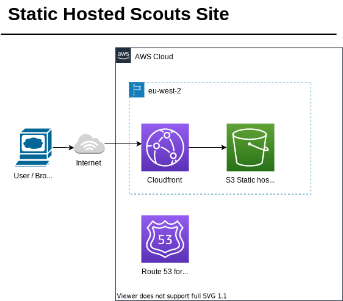

# Scouts Static Website
## Simple Static Website for 12/14th Westside Scout Group. 

A Static Site is a simple website that serves the same content to all visitors. It works well as a homepage for an organisation. Static sites can also be hosted very cheaply and securely as they no longer require a web server when using modern cloud services.

If you're a member of WSG and want to contribute please ask an [existing contributer](https://github.com/seahorseing-around/wsg-scout-website/graphs/contributors) to be given access.

_Please feel free to fork this repo for your own Scout Site. You will need to setup your own AWS Account, see the manual steps section below._

# Deploying the Site
Terraform is used to deploy the site. It can be run manually OR from Github actions. A user in the AWS account was created manually with restricted permissions to run changes against allowed services. A Key & Secret was created for that user.

## Deploy Manually (only if you know what you're doing)
1. Setup local AWS creds (from the Google Doc)
2. Use Terraform commands, specifying env vars

        terraform init --backend-config --backend-config key=develop/terraform.tfstate --var-file=develop-environment.tfvars
        terraform plan --var-file=develop-environment.tfvars  
        terraform apply --var-file=develop-environment.tfvars
        terraform destroy --var-file=develop-environment.tfvars

## Deploy Using Github
[WSG Site Deployment Action Runs](https://github.com/seahorseing-around/wsg-scout-website/actions)
- Github actions automate running code. The job runs when code is pushed to develop or main branch

  - If you push code to the **develop** branch it will automatically deploy to the [test url](https://westsidescouts-test.click)
  - (NOT YET IMPLEMENTED) If you push code to the **main** branch it will automatically deploy to the [Prod URL](https://westsidescouts.org)
- Secret credentials (AWS key & Secret) must be manualluy setup by adding Github secrets to the Gihub Repo

# Managing the site
- Users can access the AWS Account in the AWS console. They should request an account from an existing user and login to the console here: [Console Login](https://584012295436.signin.aws.amazon.com/console)
- There are manual health checks configured. These are not in Terraform so that they cannot be accidentally destroyed. They monitor the test and live URLs. It those URLS do not respond healthily then alerts are sent to an SNS topic which can alert us. 
- [WSG Alerts SNS Topic](https://us-east-1.console.aws.amazon.com/sns/v3/home?region=us-east-1#/topic/arn:aws:sns:us-east-1:584012295436:WSGAlerts)

# Notes
- [Google Document with AWS Account Details](https://docs.google.com/document/d/18WbEa5Qumo8f6hDoJRbk1vz-V55H1fqNEk1sAgX4L3E/edit?usp=sharing)
- [Architecture guide blog which I followed for instructions](https://www.alexhyett.com/terraform-s3-static-website-hosting/)
  - Note: some elements out of date
- Test/Debug URL's
  - Develop https://westsidescouts-test.click/
    - [Develop S3 Direct](https://wsg-website-dev.s3.eu-west-2.amazonaws.com/index.html)
  - Main https://westsidescouts.org

# Resources
- [National Scout Association Branding](https://scoutsbrand.org.uk/catalogue/category/digital/logos/scout-logo)
- Static Site templates 
  - https://html5up.net
- WSG G-Suite [Shared Directory Branding & images](https://drive.google.com/drive/folders/1FVgQErbhAFs5Nhvo-L9ipOWVbHszuW0I)

# Costs
[Cost Dashboard](https://us-east-1.console.aws.amazon.com/cost-management/home?region=us-east-1)
- Test Domain £3 pa
- Real Domain $?? TBC once transferred to AWS
- Running Costs £?? TBC but should be less than £5 PCM
  

# Web Dev
- To update the website start by pulling the repo locally
- Change the contents of ./site-contents/* to update the site
  - index.html and 404.html *MUST* exist in their current location for terraform to work
- To make content changes you should edit the .html files.
- Images can be added under images, and referenced from the html
- You can see html edits locally by opening  index.html in a browser
- When you've made your changes push the code to the *develop branch* to test it
- It it tests ok, merge to code to main to dpeloy the live site

## Tips
- Visual Studio Code is a great IDE - and plugins for Terraform and HTML help!

# TODO
- These Static site templates come with a lot of duplication - will look into Javascrpt solns
- Join page
- Section info pages
- Choose a template
- Port prod Domain and run in there.

# Deployment Architecture

# Manual Setup

Some elements are created manually as dependencies or by design.

- Creation of AWS Account incl. adding billing details
- Creation of Terraform system-access-only user, with full access permissions for
  - S3
  - Dynamo
  - Cloudfront
  - Route53
  - Certificate Manager
- Manually adding Terraform user AWS secrets to git repo for deploy actions
- Route53 health checks of publically avilable URLS
- SNS topic for alerts from Route53 Health Checks
- Admin users in the account
- Admin user group with permissions to access the console and certain services
  - SNS
  - Billing
  - IAM
- Console user accounts for site admins
- Test Domain
- Prod domain